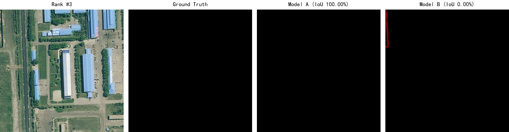
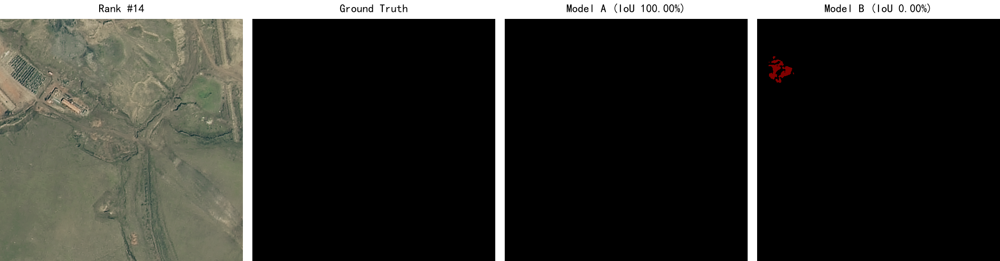
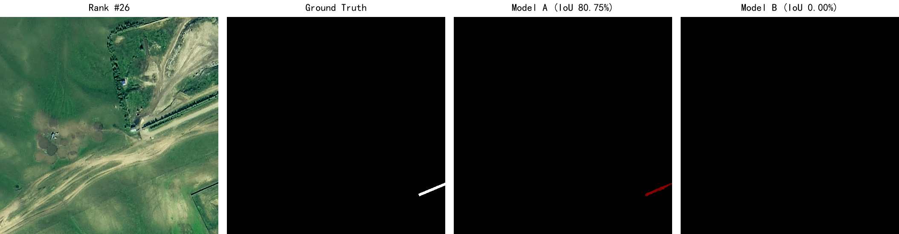
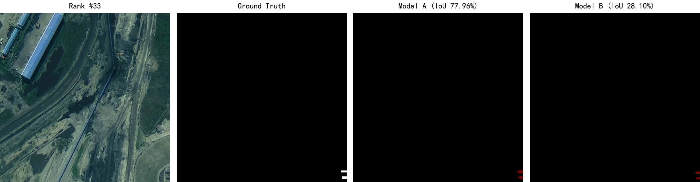
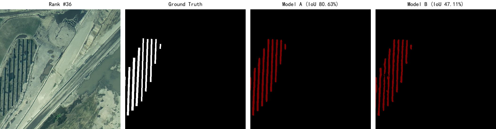
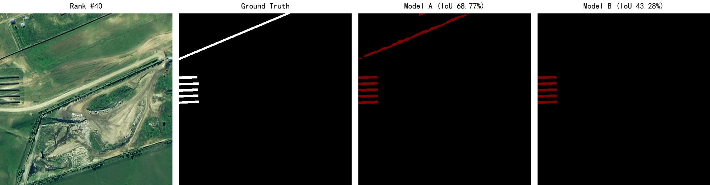

# 🌞 SolarPV-Segmentation: 基于深度学习的光伏设施智能识别

<p align="center">
  
</p>

<p align="center">
  <strong>🏆 全国一等奖 | 📊 mIoU 92.32% | 🖥️ Streamlit 可视化 Demo</strong>
</p>

<p align="center">
  <a href="README_en.md">English</a> •
  <a href="#-快速开始">快速开始</a> •
  <a href="#-效果展示">效果展示</a> •
  <a href="#-citation">引用</a>
</p>

---

## 📖 项目简介

本项目为"遥感解译大赛"全国一等奖获奖作品，实现了基于深度学习的光伏设施智能识别系统。

**核心亮点：**
- 🏆 **全国一等奖**：在遥感解译大赛中获得全国一等奖
- 📊 **高精度**：mIoU 达到 92.32%（MiT-B5 主干网络）
- 🖥️ **可视化系统**：基于 Streamlit 的交互式对比与评测平台
- 📄 **完整资料**：技术报告、海报、PPT 全部开源

## 🚀 快速开始

### 1. 环境配置

```bash
# 克隆仓库
git clone https://github.com/yourusername/SolarPV-Segmentation.git
cd SolarPV-Segmentation

# 创建虚拟环境（推荐）
python -m venv venv
source venv/bin/activate  # Linux/Mac
# venv\Scripts\activate  # Windows

# 安装依赖
pip install -r requirements.txt
```

### 2. 数据准备

1. 下载数据集（见 [data/README.md](data/README.md)）
2. 将数据放入 `data/VOCdevkit/VOC2007/` 目录
3. 运行数据准备脚本：

```bash
python src/prepare_data.py
```

### 3. 模型训练

```bash
# ResNet50 基线模型（mIoU 91.83%）
python src/train.py

# MiT-B5 进阶模型（mIoU 92.32%）
python src/train_mitb5.py
```

### 4. 模型预测

```bash
# ResNet50 预测
python src/predict.py

# MiT-B5 预测
python src/predict_mitb5.py
```

### 5. 可视化 Demo

```bash
# 启动 Streamlit 界面
streamlit run demo/app.py

# 或使用启动脚本
python demo/launch.py
```

## 📊 效果展示

### 模型对比

| 模型 | 主干网络 | mIoU | 参数量 | 推理速度 |
|------|----------|------|--------|----------|
| UNet-ResNet50 | ResNet50 | 91.83% | 32.5M | 45ms/张 |
| UNet-MiT-B5 | MiT-B5 | **92.32%** | 84.3M | 68ms/张 |

### 可视化效果

**MiT-B5 vs ResNet50 对比展示**（MiT-B5 优势明显的样例）：

<p align="center">
  
</p>
<p align="center">
  <em>Rank #3：MiT-B5 完美预测（IoU 100%），ResNet50 出现误检（IoU 0%）</em>
</p>

<p align="center">
  
</p>
<p align="center">
  <em>Rank #14：MiT-B5 完美预测（IoU 100%），ResNet50 出现误检（IoU 0%）</em>
</p>

<p align="center">
  
</p>
<p align="center">
  <em>Rank #26：MiT-B5 高精度预测（IoU 80.93%），ResNet50 完全漏检（IoU 0%）</em>
</p>

<p align="center">
  
</p>
<p align="center">
  <em>Rank #33：MiT-B5 预测准确（IoU 77.96%），ResNet50 漏检严重（IoU 28.10%）</em>
</p>

<p align="center">
  
</p>
<p align="center">
  <em>Rank #36：MiT-B5 预测准确（IoU 80.63%），ResNet50 对齐偏差大（IoU 47.11%）</em>
</p>

<p align="center">
  
</p>
<p align="center">
  <em>Rank #40：MiT-B5 预测全面（IoU 68.78%），ResNet50 漏检部分目标（IoU 43.25%）</em>
</p>

> **说明**：以上展示的是 MiT-B5 模型相比 ResNet50 优势最明显的样例（按 IoU 差距排序）。每张对比图包含：原始卫星影像、真实标签、MiT-B5 预测结果、ResNet50 预测结果。

## 📁 项目结构

```
SolarPV-Segmentation/
├── src/                    # 源代码
│   ├── train.py            # ResNet50 训练
│   ├── train_mitb5.py      # MiT-B5 训练
│   ├── predict.py          # 预测脚本
│   ├── evaluate.py         # 评估脚本
│   ├── models/             # 模型定义
│   └── utils/              # 工具函数
├── demo/                   # 可视化 Demo
├── data/                   # 数据目录
├── weights/                # 模型权重
├── docs/                   # 文档资料
└── assets/                 # 展示素材
```

## 📚 文档资料

- 📄 [技术报告](docs/technical_report.pdf)
- 🖼️ [项目海报](docs/poster.pdf)
- 📊 [演示PPT](docs/slides.pptx)
- 📝 [数据获取说明](data/README.md)
- ⚖️ [模型权重说明](weights/README.md)

## 🤝 贡献指南

欢迎贡献！请阅读 [CONTRIBUTING.md](CONTRIBUTING.md) 了解如何参与。

## 📜 许可证

本项目基于 MIT 许可证开源，详见 [LICENSE](LICENSE)。

**注意**：本项目基于 [bubbliiiing/unet-pytorch](https://github.com/bubbliiiing/unet-pytorch) 改进，保留了原作者的版权声明。

## 🙏 致谢

- 感谢 [bubbliiiing](https://github.com/bubbliiiing) 提供的 UNet 基础实现
- 感谢 [segmentation_models_pytorch](https://github.com/qubvel/segmentation_models.pytorch) 提供的 MiT-B5 主干网络
- 感谢大赛组委会提供的数据集和评审

## 📧 联系方式

如有问题，请通过以下方式联系：
- 提交 [Issue](https://github.com/yourusername/SolarPV-Segmentation/issues)
- 邮箱：your.email@example.com

## ⭐ Star History

[](https://star-history.com/#yourusername/SolarPV-Segmentation&Date)

---

<p align="center">
  如果觉得有帮助，请给个 ⭐ 支持一下！
</p>