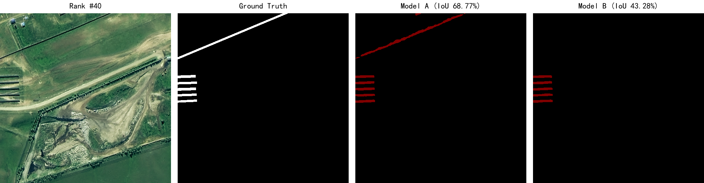

# 🌞 SolarPV-Segmentation

**面向高分辨率遥感影像的光伏设施语义分割、模型评测与可视化平台**

> 🏆 第六届国际高分辨率遥感图像智能解译大赛决赛一等奖  ·  📊 MiT-B5 mIoU 92.32%  ·  🖥️ Streamlit 交互式评测平台

<p align="center">
  <a href="README_en.md">English</a> ·
  <a href="#-快速体验">快速体验</a> ·
  <a href="#-评测结果">评测结果</a> ·
  <a href="docs/technical_report.pdf">技术报告</a> ·
  <a href="docs/poster.pdf">项目海报</a>
</p>

<p align="center">
  
</p>

## 📖 项目简介

本项目面向高分二号等高分辨率遥感影像中的光伏设施识别，构建了从数据准备、模型训练、批量推理到自动评测和错误样本复盘的完整工作流。项目采用 UNet 语义分割框架，对 ResNet50 与 MiT-B5 主干网络开展对照实验，并通过 Streamlit 封装为可交互的模型评测与预测平台。

项目在**第六届国际高分辨率遥感图像智能解译大赛决赛**中获得**一等奖**。

## ✨ 核心能力

- **模型训练**：支持 UNet-ResNet50 与 UNet-MiT-B5 的训练、验证和权重管理。
- **单图评测**：并排展示原始影像、真实标签和不同模型预测结果，自动计算 IoU。
- **批量机评**：批量推理并生成逐样本 IoU、模型差值和 CSV 评测报告。
- **错误样本复盘**：按模型差异筛选 Top-K 样本，定位误检、漏检和边界偏差。
- **结果可视化**：提供单图预测、批量预测、模型对比和结果浏览等交互界面。

## 🖥️ 平台功能

| 功能模块 | 说明 |
|---|---|
| 多模型对比 | 在同一影像上比较不同主干网络的预测结果与 IoU |
| 批量评测 | 遍历测试集，输出 mIoU、逐图指标和 CSV 报告 |
| 单张预测 | 上传遥感影像并查看光伏设施分割结果 |
| 批量预测 | 对影像目录执行批量推理并统一保存成果 |
| 结果浏览 | 分页浏览原图、标签和预测结果，复盘典型错误样本 |

## 📊 评测结果

| 模型 | 主干网络 | mIoU |
|---|---|---:|
| UNet-ResNet50 | ResNet50 | 91.83% |
| **UNet-MiT-B5** | **MiT-B5** | **92.32%** |

MiT-B5 方案较 ResNet50 参考方案提升 **0.49 个百分点**。以下样本按照两种模型的 IoU 差异筛选，用于展示边界完整性、漏检和误检差异。

<p align="center">
  
</p>
<p align="center">
  
</p>
<p align="center">
  
</p>

## 🚀 快速体验

### 1. 安装环境

```bash
git clone https://github.com/2839181579/SolarPV-Segmentation.git
cd SolarPV-Segmentation

python -m venv .venv
# Windows
.venv\Scripts\activate
# Linux / macOS
# source .venv/bin/activate

pip install -r requirements.txt
```

### 2. 启动可视化平台

```bash
streamlit run demo/app.py
```

也可以运行：

```bash
python demo/launch.py
```

仓库自带 3 组样例影像与标签，可直接查看界面和数据格式。执行真实模型预测前，请将训练得到的权重放入 `weights/`，或在界面中选择本地权重文件。

### 3. 训练与评测

```bash
# 数据划分
python src/prepare_data.py

# ResNet50 与 MiT-B5 训练
python src/train.py
python src/train_mitb5.py

# 预测与评测
python src/predict.py
python src/predict_mitb5.py
python src/evaluate.py
```

完整数据集的目录规范和划分方式见 [data/README.md](data/README.md)，权重使用说明见 [weights/README.md](weights/README.md)。

## 📁 项目结构

```text
SolarPV-Segmentation/
├── demo/                 # Streamlit 模型评测与预测平台
├── src/                  # 训练、推理、评测与模型代码
├── data/                 # 样例数据与数据准备说明
├── weights/              # 本地模型权重目录（大文件不纳入 Git）
├── assets/               # 平台截图与典型评测样本
├── docs/                 # 技术报告与项目海报
└── requirements.txt
```

## 📚 项目材料

- [技术报告](docs/technical_report.pdf)
- [项目海报](docs/poster.pdf)
- [数据说明](data/README.md)
- [权重说明](weights/README.md)
- [技术博客](blog/csdn_blog.md)

## ⚠️ 复现说明

- 完整比赛数据与训练权重文件体积较大，且应遵守赛事数据使用要求，因此不直接纳入 Git 仓库。
- 仓库提供样例影像、核心代码、评测结果、技术报告和界面，便于理解项目流程与复现方法。
- README 中的指标来自比赛项目记录；不同硬件、随机种子和数据划分可能导致结果轻微波动。

## 🙏 致谢与许可

本项目基于 [bubbliiiing/unet-pytorch](https://github.com/bubbliiiing/unet-pytorch) 改进，并使用 [segmentation_models_pytorch](https://github.com/qubvel/segmentation_models.pytorch) 提供的 MiT-B5 编码器实现。代码采用 [MIT License](LICENSE)。

如有问题，欢迎提交 [Issue](https://github.com/2839181579/SolarPV-Segmentation/issues)。

## 📝 Citation

```bibtex
@misc{ma2025solarpv,
  title        = {SolarPV-Segmentation: Solar PV Facility Segmentation and Evaluation Platform},
  author       = {Ma, Shaobo},
  year         = {2025},
  howpublished = {GitHub},
  url          = {https://github.com/2839181579/SolarPV-Segmentation}
}
```
