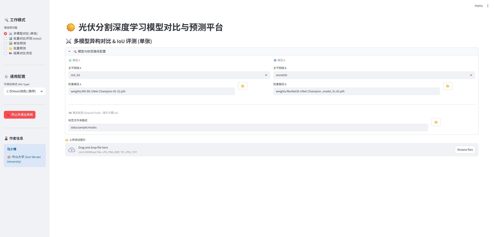
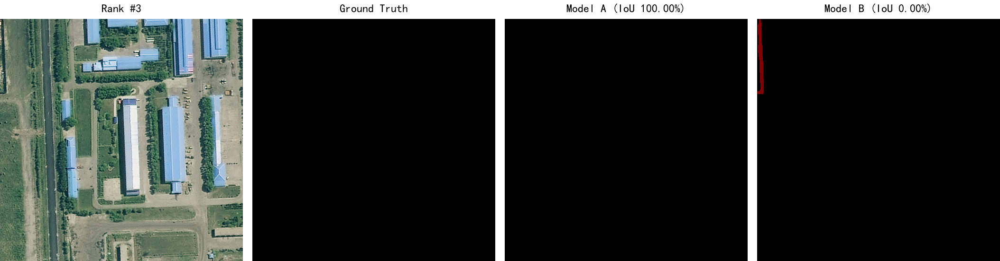
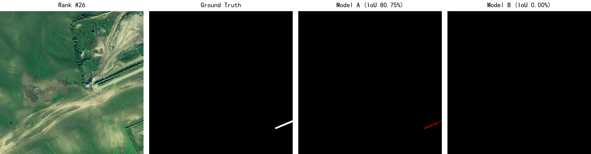

# 🌞 SolarPV-Segmentation

**Semantic segmentation, model evaluation, and visualization platform for solar PV facilities in high-resolution remote-sensing imagery**

> 🏆 1st Prize, Final of the 6th International High-Resolution Remote Sensing Image Interpretation Contest · 📊 MiT-B5 mIoU 92.32% · 🖥️ Streamlit evaluation platform

<p align="center">
  <a href="README.md">中文</a> ·
  <a href="#quick-start">Quick Start</a> ·
  <a href="#evaluation-results">Results</a> ·
  <a href="docs/technical_report.pdf">Technical Report</a> ·
  <a href="docs/poster.pdf">Poster</a>
</p>

<p align="center">
  
</p>

## Overview

This project provides an end-to-end workflow for solar PV facility recognition in high-resolution remote-sensing images, covering data preparation, model training, batch inference, automated evaluation, and error-sample review. UNet models with ResNet50 and MiT-B5 backbones are compared and exposed through an interactive Streamlit application.

The project won **1st Prize in the final of the 6th International High-Resolution Remote Sensing Image Interpretation Contest**.

## Features

- Train and evaluate UNet-ResNet50 and UNet-MiT-B5 models.
- Compare multiple models on a single image and calculate IoU automatically.
- Run batch inference and export per-image metrics and CSV reports.
- Rank Top-K disagreement cases for false-positive, false-negative, and boundary-error analysis.
- Browse single-image prediction, batch results, labels, and model comparisons in Streamlit.

## Evaluation Results

| Model | Backbone | mIoU |
|---|---|---:|
| UNet-ResNet50 | ResNet50 | 91.83% |
| **UNet-MiT-B5** | **MiT-B5** | **92.32%** |

The MiT-B5 model improves over the ResNet50 reference by **0.49 percentage points**.

<p align="center"></p>
<p align="center"></p>

## Quick Start

```bash
git clone https://github.com/2839181579/SolarPV-Segmentation.git
cd SolarPV-Segmentation
python -m venv .venv
# Windows: .venv\Scripts\activate
# Linux/macOS: source .venv/bin/activate
pip install -r requirements.txt
streamlit run demo/app.py
```

The repository includes three image/mask pairs for interface and format inspection. Place locally trained weights in `weights/`, or select a weight file in the application, before running model inference.

```bash
python src/prepare_data.py
python src/train.py
python src/train_mitb5.py
python src/predict.py
python src/predict_mitb5.py
python src/evaluate.py
```

## Repository Structure

```text
demo/       Streamlit evaluation and prediction application
src/        Training, inference, evaluation, and model code
data/       Sample data and dataset instructions
weights/    Local model weights, excluded from Git
assets/     Interface screenshot and evaluation examples
docs/       Technical report and poster
```

## Reproducibility Notes

- Full competition data and trained weights are not committed because of file size and competition data-use requirements.
- Sample data, source code, evaluation evidence, the technical report, and the interactive interface are included.
- Reported metrics come from the competition project records and may vary slightly with hardware, random seeds, or data splits.

## Acknowledgements and License

This project builds on [bubbliiiing/unet-pytorch](https://github.com/bubbliiiing/unet-pytorch) and uses the MiT-B5 encoder from [segmentation_models_pytorch](https://github.com/qubvel/segmentation_models.pytorch). Released under the [MIT License](LICENSE).

Questions and feedback are welcome through [GitHub Issues](https://github.com/2839181579/SolarPV-Segmentation/issues).
